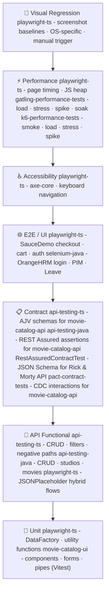

# QA Test Strategy

Documentation-only repository. No test code lives here - this is the **strategic and architectural thinking** behind a multi-framework, multi-language QA automation portfolio.

It explains what was built, why each tool was chosen, what risks each layer addresses, and how the CI pipelines are structured.

---

## Portfolio

Nine projects covering the full testing pyramid across five applications.

| Project                                                                             | Language / Tool                        | Test Types                                                                | Application                 |
|-------------------------------------------------------------------------------------|----------------------------------------|---------------------------------------------------------------------------|-----------------------------|
| [playwright-ts](https://github.com/EnesAkyel/playwright-ts)                         | TypeScript · Playwright                | E2E · API · Accessibility · Visual · Performance · Network mocking · Auth | SauceDemo · JSONPlaceholder |
| [api-testing-ts](https://github.com/EnesAkyel/api-testing-ts)                       | TypeScript · Jest · Axios · AJV        | Smoke · Contract · Integration · Regression                               | movie-catalog-api           |
| [api-testing-java](https://github.com/EnesAkyel/api-testing-java)                   | Java · REST Assured · TestNG           | Smoke · Contract · Integration · Regression                               | movie-catalog-api           |
| [movie-catalog-ui](https://github.com/EnesAkyel/movie-catalog-ui)                   | TypeScript · Angular 22 · Vitest       | Component / Unit · Reactive-forms validation                              | movie-catalog-ui (self)     |
| [gatling-performance-tests](https://github.com/EnesAkyel/gatling-performance-tests) | Java · Gatling                         | Load · Stress · Spike · Soak                                              | JSONPlaceholder             |
| [k6-performance-tests](https://github.com/EnesAkyel/k6-performance-tests)           | TypeScript · k6 · esbuild              | Smoke · Load · Stress · Spike                                             | movie-catalog-api           |
| [RestAssuredContractTest](https://github.com/EnesAkyel/RestAssuredContractTest)     | Java · REST Assured · TestNG           | Contract · Negative                                                       | Rick & Morty API            |
| [pact-contract-tests](https://github.com/EnesAkyel/pact-contract-tests)             | TypeScript · Pact · Jest               | Consumer-driven contract (CDC) · Provider verification                    | movie-catalog-api           |
| [selenium-java](https://github.com/EnesAkyel/selenium-java)                         | Java · Selenium · TestNG · PageFactory | E2E · Login · PIM · Leave                                                 | OrangeHRM                   |

---

## Testing pyramid

---

## Documents

### Strategy

| Document                                                             | What it covers                                                                                     |
|----------------------------------------------------------------------|----------------------------------------------------------------------------------------------------|
| [playwright-ts](strategy/playwright-ts.md)                           | Philosophy, testing pyramid, tool choices, tagging, flakiness policy, definition of done           |
| [api-testing-ts](strategy/api-testing-ts.md)                         | Jest suite separation, AJV contract validation, typed API client, test data approach               |
| [gatling-performance-tests](strategy/gatling-performance-tests.md)   | Simulation types, load profiles, thresholds, tool choice rationale                                 |
| [k6-performance-tests](strategy/k6-performance-tests.md)             | Scenario design, per-scenario thresholds, TypeScript bundling, tool choice vs Gatling              |
| [rest-assured-contract-test](strategy/rest-assured-contract-test.md) | Contract testing approach, JSON Schema validation, negative contract testing                       |
| [selenium-java](strategy/selenium-java.md)                           | OrangeHRM target, PageFactory POM, AspectJ Allure steps, smoke/regression CI with GitHub Pages     |
| [api-testing-java](strategy/api-testing-java.md)                     | REST Assured suite separation, movie-catalog-api target, comparison with api-testing-ts            |
| [movie-catalog-ui](strategy/movie-catalog-ui.md)                     | Vitest component testing, reactive-forms validation, testability-by-design for a planned E2E layer |
| [pact-contract-tests](strategy/pact-contract-tests.md)               | CDC approach, interaction design, Pact V4 matchers, provider state strategy, tool choice vs schema validation |
| [Coverage Matrix](strategy/coverage-matrix.md)                       | All frameworks × test types × applications - gaps and rationale                                    |
| [Risk Areas](strategy/risk-areas.md)                                 | Risk register: likelihood, impact, and coverage for each area                                      |

### Architecture

| Document                                                   | What it covers                                                                   |
|------------------------------------------------------------|----------------------------------------------------------------------------------|
| [System Architecture](architecture/system-architecture.md) | Portfolio map, testing pyramid, internal architecture diagrams, design decisions |
| [CI/CD Pipeline](architecture/ci-pipeline.md)              | Pipeline stages, flow diagrams, and key decisions for each project               |

---

## Author

**Enes Akyel**  
SDET | QA Automation Engineer  
[LinkedIn](https://www.linkedin.com/in/enes-akyel-2a77a7122/) · [GitHub](https://github.com/EnesAkyel)
