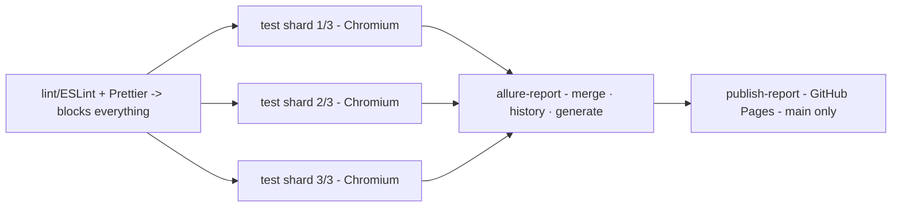
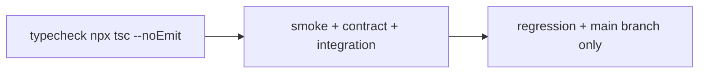
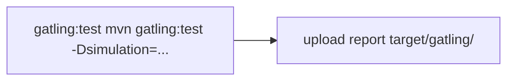
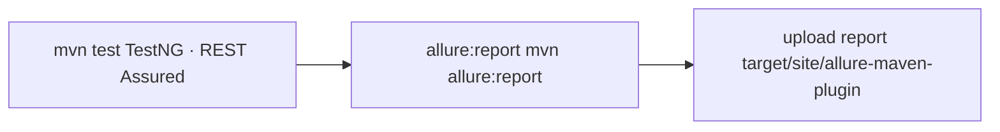
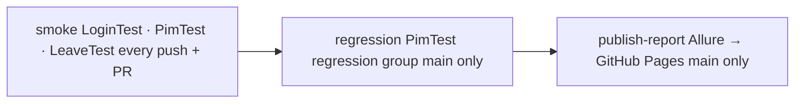
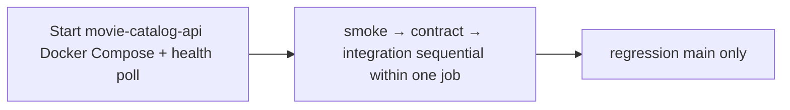

# CI/CD Pipeline

CI pipelines for each project in the portfolio. Three projects have full pipelines; one has no CI by design.

---

## playwright-ts

**Triggers:** push to `main`, every pull request, manual dispatch  
**Platform:** GitHub Actions · `ubuntu-latest`

### Stages

**`lint`** - runs first, blocks the test job on failure. Two checks:
- `npm run lint` - ESLint with `eslint-plugin-playwright` and `typescript-eslint`
- `npm run format:check` - Prettier in check-only mode

No test runs if lint fails. This keeps the test job's failure signal clean - a red test job always means a test problem, not a formatting issue.

**`test` (matrix: 3 shards)** - the regression suite splits across three parallel runners using `--shard=N/3`. Each shard:
- Resolves environment config from GitHub Secrets based on target environment
- Runs `npx playwright test --grep @regression --shard=N/3 --project=chromium`
- Uploads its own Allure results, JUnit XML, and Playwright HTML report as separate artifacts
- Publishes a test summary via `dorny/test-reporter` using the JUnit XML

Shards run with `fail-fast: false` - if shard 2 fails, shards 1 and 3 still complete and upload their results.

**`publish-report`** - runs after `allure-report`, on pushes to `main` only:
- Downloads the generated Allure report artifact
- Deploys it to the `gh-pages` branch via `peaceiris/actions-gh-pages@v4`
- The published report is accessible as a GitHub Pages site

**`allure-report`** - runs after all shards, even if some shards failed (`if: always()`):
- Downloads all shard Allure results with `merge-multiple: true`
- Restores the `allure-history` artifact from the previous successful push to `main` using `dawidd6/action-download-artifact`
- Injects history into the current results before generating - this produces Allure's trend charts (pass rate, duration, flakiness) across runs
- Saves the new history back as an artifact with `overwrite: true` so the next run can use it

### Nightly regression (`scheduled.yml`)

- Runs at 02:00 UTC daily
- Matrix: Chromium × Firefox (2 parallel jobs)
- Creates a GitHub issue on failure with a link to the run - distinguishes infrastructure failures from code failures

### Manual snapshot update (`update-snapshots.yml`)

- Triggered from the Actions tab
- Generates Linux visual baselines on `ubuntu-latest`
- Uploads snapshots as a downloadable artifact to commit into the repo
- Visual tests are excluded from the automated regression suite to avoid false failures from OS rendering differences

### Key decisions

**Sharding over a single job** - the regression suite has enough tests that a single runner would hit the 60-minute timeout under load. Three shards bring wall-clock time under 20 minutes. The `TOTAL_SHARDS` env var makes the count adjustable without editing the matrix.

**Browser cache with `--with-deps` fallback** - Playwright browsers are cached by `package-lock.json` hash. On a cache hit, only `install-deps` (system libraries) runs. On a miss, the full `install --with-deps` runs. This avoids the 2–3 minute browser download on every run after the first.

**Lint blocks test, Allure depends on both** - the dependency chain (`lint → test → allure-report`) means the Allure report is only generated when there are real results to report. It does not run on lint-only failures.

---

## api-testing-ts

**Triggers:** push to `main`, every pull request  
**Platform:** GitHub Actions · `ubuntu-latest`

### Stages

**`typecheck`** - runs `tsc --noEmit` before any tests. Catches type errors that would cause runtime failures in Jest without running a single test. Fast and cheap.

**`test`** - starts `movie-catalog-api` via Docker Compose before running tests:

1. Checks out `api-testing-ts`
2. Checks out `EnesAkyel/movie-catalog-api` into a subdirectory
3. Runs `docker compose up -d --build` in the API directory
4. Polls `GET /movies` every 5 seconds for up to 150 seconds until the API responds
5. Runs smoke → contract → integration in sequence

The polling step prevents tests from starting against a partially initialized Spring Boot application.

**`regression`** - runs only on pushes to `main` (`if: github.ref == 'refs/heads/main'`). Uses the same Docker Compose startup sequence but runs the full regression suite with `--verbose`. Pull requests do not trigger regression - they get smoke + contract + integration only.

### Key decisions

**Two-repo checkout** - `movie-catalog-api` is a separate repository. The pipeline checks it out at runtime rather than requiring it to be pre-deployed. This means the API under test is always the current `main` of `movie-catalog-api`, not a potentially stale deployed instance.

**Smoke before contract before integration** - running in order means the cheapest, most signal-dense tests fail first. If smoke fails (API unreachable or returning 5xx), contract and integration are skipped. The failure is immediately diagnosable without reading the full test output.

**Regression gated to `main`** - regression runs are slower and more expensive. Running them on every PR would increase CI time without proportional benefit. The PR gate (smoke + contract + integration) is sufficient to catch regressions before merge.

---

## gatling-performance-tests

**Triggers:** push to `main`, every pull request, manual dispatch  
**Platform:** GitHub Actions · `ubuntu-latest` · Java 25 (Temurin)

### Stages

**`gatling`** - single job. Runs one simulation per trigger:
- On push/PR: `BasicSimulation` (default - verifies the endpoint is reachable and responding within thresholds)
- On manual dispatch: the operator selects which simulation to run from a dropdown (`Basic`, `Load`, `Stress`, `Spike`, `Soak`)

The Gatling HTML report is uploaded as an artifact with a 30-day retention window.

### Key decisions

**Manual dispatch for heavy simulations** - load, stress, spike, and soak simulations run for minutes and generate sustained traffic against a public API. Running them automatically on every push would be irresponsible and expensive. The manual trigger puts the operator in control of when heavier simulations run.

**`BasicSimulation` as the automatic gate** - a minimal smoke-level simulation runs automatically. It confirms that the target API is reachable and that the Gatling setup works, without generating meaningful load.

**No matrix** - unlike `playwright-ts`, there is no value in running multiple simulations in parallel automatically. Each simulation is a specific question (load vs. stress vs. spike) that the operator chooses intentionally.

---

## RestAssuredContractTest

**Triggers:** push to `main`, every pull request  
**Platform:** GitHub Actions · `ubuntu-latest` · Java 25 (Temurin)

### Stages

**`test`** - runs `mvn test`. TestNG executes all contract and negative tests against the live Rick & Morty API. No application setup required - the target is a public API with no authentication.

**`allure:report`** - generates the Allure HTML report from TestNG results. Runs with `if: always()` so the report is available even when tests fail.

### Key decisions

**No application startup step** - unlike `api-testing-ts`, the target is a public third-party API. There is nothing to deploy or start.

**Simple single-job pipeline** - contract tests for a stable public API do not need sharding, matrix strategies, or complex gating. The pipeline is deliberately minimal.

---

## selenium-java

**Triggers:** push to `main`, every pull request  
**Platform:** GitHub Actions · `ubuntu-latest` · Java 25 (Temurin)

### Stages

**`smoke`** - runs on every push and every PR. Covers login validation, employee list load, and Leave module navigation. Fast gate - if login is broken or OrangeHRM is unreachable, this fails in under a minute.

**`regression`** - runs on `main` only after smoke passes. Covers the create-employee flow and any future regression-tagged tests.

Both jobs publish a test summary via `dorny/test-reporter` using `TEST-*.xml` (JUnit-compatible Surefire output). `testng-results.xml` is excluded because `java-junit` reporter cannot parse the TestNG native format.

**`publish-report`** - merges Allure results from smoke and regression (using `pattern: allure-results-*` + `merge-multiple: true`), loads history from `gh-pages`, generates the report, and deploys it via `peaceiris/actions-gh-pages@v4`.

### Key decisions

**Smoke before regression with `needs: smoke`** - smoke runs on PRs; regression only on `main`. This keeps PR feedback fast while ensuring the full suite runs before anything lands on `main`.

**`push: branches: [main]` only (not `["**"]`)** - an earlier version used `push: branches: ["**"]` alongside `pull_request`, which caused smoke to run twice on every PR push. Restricting push to `main` eliminates the duplicate.

**AspectJ 1.9.25.1** - Allure `@Step` annotations require AspectJ load-time weaving (`-javaagent`). Version `1.9.25.1` is the minimum that supports Java 21 class files (major version 65).

---

## api-testing-java

**Triggers:** push to `main`, every pull request  
**Platform:** GitHub Actions · `ubuntu-latest` · Java 25 (Temurin)

### Stages

**`test` job** - checks out both `api-testing-java` and `movie-catalog-api`, starts the API via Docker Compose, polls `GET /movies` every 5 seconds (up to 150 seconds), then runs smoke → contract → integration in sequence. If smoke fails, contract and integration are skipped.

**`regression`** - runs on `main` only after the `test` job passes. Same Docker Compose startup pattern, then runs the full regression group with verbose output.

### Key decisions

**Two-repo checkout** - `movie-catalog-api` is a separate repository checked out at runtime. The API under test is always the current `main` of `movie-catalog-api`, not a potentially stale deployed instance.

**Sequential test groups within one job** - unlike `playwright-ts` which shards across parallel runners, the API test suite is fast enough that sequential group execution is sufficient. Running smoke before contract before integration means the cheapest diagnostic signal fails first.

