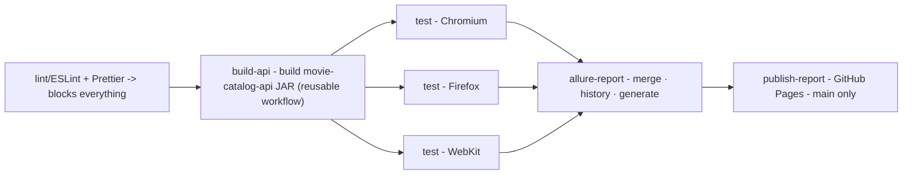
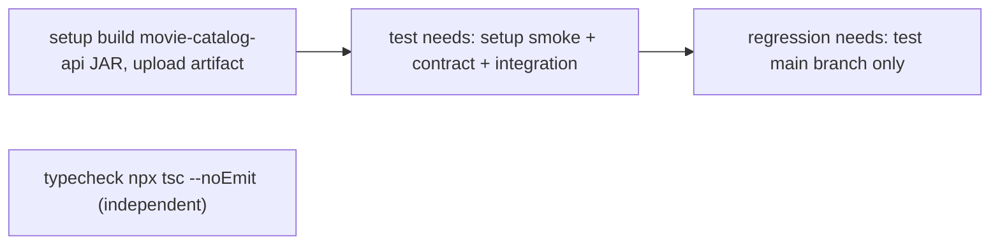
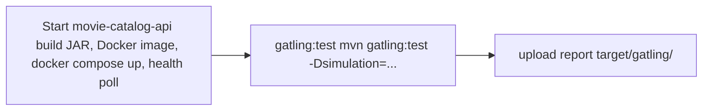
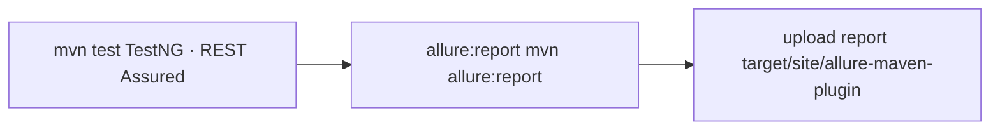
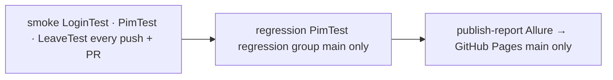
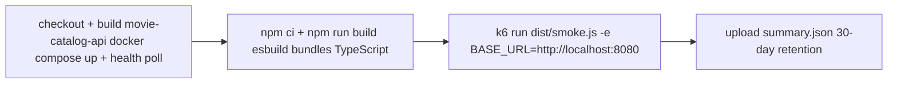
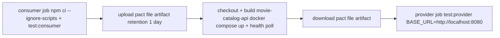
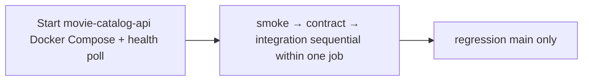
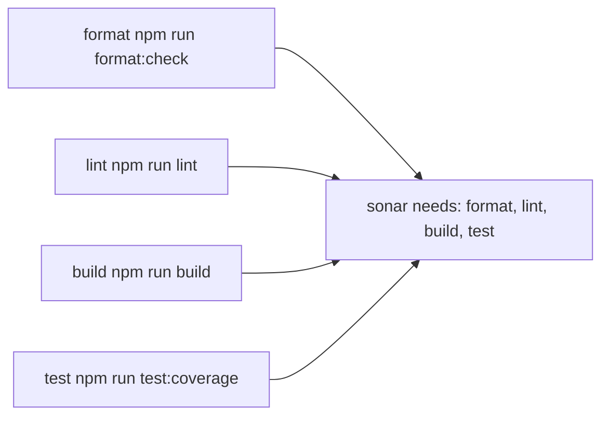

# CI/CD Pipeline

CI pipelines for each project in the portfolio, plus `movie-catalog-ui` (the application under test for several of them).

---

## playwright-ts

**Triggers:** push to `main`, every pull request, manual dispatch  
**Platform:** GitHub Actions · `ubuntu-latest`

```mermaid
flowchart LR
    L["lint/ESLint + Prettier -> blocks everything"]
    B["build-api - build movie-catalog-api JAR (reusable workflow)"]
    T1["test - Chromium"]
    T2["test - Firefox"]
    T3["test - WebKit"]
    AR["allure-report - merge · history · generate"]
    PR["publish-report - GitHub Pages - main only"]

    L --> B --> T1 & T2 & T3 --> AR --> PR
```

### Stages

**`lint`** - runs first, blocks the test job on failure. Two checks:
- `npm run lint` - ESLint with `eslint-plugin-playwright` and `typescript-eslint`
- `npm run format:check` - Prettier in check-only mode

No test runs if lint fails. This keeps the test job's failure signal clean - a red test job always means a test problem, not a formatting issue.

**`build-api`** - a reusable workflow that checks out `movie-catalog-api`, builds the JAR with Maven, and uploads it as an artifact so the `test` job doesn't rebuild it per browser.

**`test` (matrix: 3 browsers)** - the `@regression` suite (or, via manual `workflow_dispatch`, an operator-chosen tag subset - `smoke`/`regression`/`a11y`/`visual`/`all`) runs in full against each of Chromium, Firefox, and WebKit in parallel. Each browser's job:
- Boots the `movie-catalog-ui` + `movie-catalog-api` stack fresh via the `boot-stack` composite action
- Runs `npx playwright test --grep @<suite> --project=<browser>`
- Uploads its own Allure results, JUnit XML, and Playwright HTML report as separate artifacts
- Publishes a test summary via `dorny/test-reporter` using the JUnit XML

The matrix runs with `fail-fast: false` - if the Firefox job fails, Chromium and WebKit still complete and upload their results.

**`publish-report`** - runs after `allure-report`, on pushes to `main` only:
- Downloads the generated Allure report artifact
- Deploys it to the `gh-pages` branch via `peaceiris/actions-gh-pages@v4`
- The published report is accessible as a GitHub Pages site

**`allure-report`** - runs after all shards, even if some shards failed (`if: always()`):
- Downloads all shard Allure results with `merge-multiple: true`
- Restores the `allure-history` artifact from the previous successful push to `main` using `dawidd6/action-download-artifact`
- Injects history into the current results before generating - this produces Allure's trend charts (pass rate, duration, flakiness) across runs
- Saves the new history back as an artifact with `overwrite: true` so the next run can use it

### Nightly regression (`scheduled.yml`)

- Runs at 02:00 UTC daily
- Matrix: Chromium × Firefox (2 parallel jobs)
- Creates a GitHub issue on failure with a link to the run - distinguishes infrastructure failures from code failures

### Manual snapshot update (`update-snapshots.yml`)

- Triggered from the Actions tab
- Generates Linux visual baselines on `ubuntu-latest`
- Uploads snapshots as a downloadable artifact to commit into the repo
- Visual tests are excluded from the automated regression suite to avoid false failures from OS rendering differences

### Key decisions

**Browser matrix over a single job** - running Chromium, Firefox, and WebKit in parallel keeps wall-clock time down the same way sharding would, but also catches a cross-browser regression directly in the PR gate instead of waiting for the nightly run to notice it. `fail-fast: false` means one browser's failure never hides the other two's results.

**Browser cache with `--with-deps` fallback** - Playwright browsers are cached by `package-lock.json` hash. On a cache hit, only `install-deps` (system libraries) runs. On a miss, the full `install --with-deps` runs. This avoids the 2–3 minute browser download on every run after the first.

**Docker layer caching for the API image build** - `start-api`'s composite action builds `movie-catalog-api`'s `Dockerfile.ci` via `docker/build-push-action` with `cache-from/to: type=gha`, so the base JRE image layer is cached across runs instead of re-pulled every time - the only layer worth caching, since the `COPY app.jar` layer changes on every run by design.

**Lint blocks test, Allure depends on both** - the dependency chain (`lint → build-api → test → allure-report`) means the Allure report is only generated when there are real results to report. It does not run on lint-only failures.

---

## api-testing-ts

**Triggers:** push to `main`, every pull request  
**Platform:** GitHub Actions · `ubuntu-latest`

```mermaid
flowchart LR
    S["setup build movie-catalog-api JAR, upload artifact"]
    TC["typecheck npx tsc --noEmit (independent)"]
    T["test needs: setup smoke + contract + integration"]
    RG["regression needs: test main branch only"]

    S --> T --> RG
```

### Stages

**`setup`** - checks out `movie-catalog-api`, builds it (`./mvnw package -DskipTests -q`), and uploads the JAR as a 1-day-retention artifact so `test` and `regression` don't each rebuild it from source.

**`typecheck`** - runs `tsc --noEmit` independently, with no dependency on `setup` since it needs no running API. Catches type errors that would cause runtime failures in Jest without running a single test.

**`test`** (needs `setup`) - starts the API via the shared `./.github/actions/start-api` composite action: downloads the prebuilt JAR artifact, builds a Docker image from `Dockerfile.ci`, runs `docker compose up -d` with `AUTH_USERNAME`/`AUTH_PASSWORD`/`JWT_SECRET` from GitHub Secrets, and polls `GET /v3/api-docs` (a `permitAll()` route) every 5 seconds for up to 150 seconds. Then runs smoke → contract → integration in sequence, each step with `AUTH_USERNAME`/`AUTH_PASSWORD` forwarded so the suites can log in via `/auth/login` before hitting protected endpoints.

**`regression`** - runs only on pushes to `main` (`if: github.ref == 'refs/heads/main'`). Uses the same composite-action startup, then runs the full regression suite with `--verbose`. Pull requests do not trigger regression - they get smoke + contract + integration only.

### Key decisions

**Two-repo checkout** - `movie-catalog-api` is a separate repository. The pipeline checks it out at runtime rather than requiring it to be pre-deployed. This means the API under test is always the current `main` of `movie-catalog-api`, not a potentially stale deployed instance.

**Shared JAR artifact instead of rebuilding per job** - `setup` builds the JAR once; both `test` and `regression` reuse it via the `start-api` composite action instead of re-running Maven, keeping the auth-gated jobs fast.

**Smoke before contract before integration** - running in order means the cheapest, most signal-dense tests fail first. If smoke fails (API unreachable, returning 5xx, or auth rejected), contract and integration are skipped. The failure is immediately diagnosable without reading the full test output.

**Regression gated to `main`** - regression runs are slower and more expensive. Running them on every PR would increase CI time without proportional benefit. The PR gate (smoke + contract + integration) is sufficient to catch regressions before merge.

---

## gatling-performance-tests

**Triggers:** push to `main`/`master`, every pull request, manual dispatch  
**Platform:** GitHub Actions · `ubuntu-latest` · Java 25 (Temurin)

```mermaid
flowchart LR
    API["Start movie-catalog-api build JAR, Docker image, docker compose up, health poll"]
    GA["gatling:test mvn gatling:test -Dsimulation=..."]
    RP["upload report target/gatling/"]

    API --> GA --> RP
```

### Stages

**API bootstrap** - checks out `EnesAkyel/movie-catalog-api`, builds the JAR (`./mvnw package -DskipTests -q`), builds a Docker image from `Dockerfile.ci`, and starts it with `docker compose up -d` using `AUTH_USERNAME`/`AUTH_PASSWORD`/`JWT_SECRET` from GitHub Secrets. Polls `GET /v3/api-docs` every 5 seconds for up to 150 seconds before proceeding.

**`gatling`** - runs one simulation per trigger, with `AUTH_USERNAME`/`AUTH_PASSWORD` forwarded so `MovieScenarios`' shared login step can obtain a JWT before exercising protected endpoints:
- On push/PR: `BasicSimulation` (default - verifies each endpoint is reachable and responding within thresholds)
- On manual dispatch: the operator selects which simulation to run from a dropdown (`Basic`, `Load`, `Stress`, `Spike`, `Soak`)

The Gatling HTML report is uploaded as an artifact with a 30-day retention window.

### Key decisions

**Manual dispatch for heavy simulations** - load, stress, spike, and soak simulations run for minutes and generate sustained traffic against the API. Running them automatically on every push would be irresponsible and expensive. The manual trigger puts the operator in control of when heavier simulations run.

**`BasicSimulation` as the automatic gate** - a minimal smoke-level simulation runs automatically. It confirms that the target API is reachable, authenticates correctly, and that the Gatling setup works, without generating meaningful load.

**No matrix** - unlike `playwright-ts`, there is no value in running multiple simulations in parallel automatically. Each simulation is a specific question (load vs. stress vs. spike) that the operator chooses intentionally.

---

## RestAssuredContractTest

**Triggers:** push to `main`, every pull request  
**Platform:** GitHub Actions · `ubuntu-latest` · Java 25 (Temurin)

```mermaid
flowchart LR
    T["mvn test TestNG · REST Assured"]
    A["allure:report mvn allure:report"]
    U["upload report target/site/allure-maven-plugin"]

    T --> A --> U
```

### Stages

**`test`** - runs `mvn test`. TestNG executes all contract and negative tests against the live Rick & Morty API. No application setup required - the target is a public API with no authentication.

**`allure:report`** - generates the Allure HTML report from TestNG results. Runs with `if: always()` so the report is available even when tests fail.

### Key decisions

**No application startup step** - unlike `api-testing-ts`, the target is a public third-party API. There is nothing to deploy or start.

**Simple single-job pipeline** - contract tests for a stable public API do not need sharding, matrix strategies, or complex gating. The pipeline is deliberately minimal.

---

## selenium-java

**Triggers:** push to `main`, every pull request  
**Platform:** GitHub Actions · `ubuntu-latest` · Java 25 (Temurin)

```mermaid
flowchart LR
    SM["smoke LoginTest · PimTest · LeaveTest every push + PR"]
    RG["regression PimTest regression group main only"]
    PR["publish-report Allure → GitHub Pages main only"]

    SM --> RG --> PR
```

### Stages

**`smoke`** - runs on every push and every PR. Covers login validation, employee list load, and Leave module navigation. Fast gate - if login is broken or OrangeHRM is unreachable, this fails in under a minute.

**`regression`** - runs on `main` only after smoke passes. Covers the create-employee flow and any future regression-tagged tests.

Both jobs publish a test summary via `dorny/test-reporter` using `TEST-*.xml` (JUnit-compatible Surefire output). `testng-results.xml` is excluded because `java-junit` reporter cannot parse the TestNG native format.

**`publish-report`** - merges Allure results from smoke and regression (using `pattern: allure-results-*` + `merge-multiple: true`), loads history from `gh-pages`, generates the report, and deploys it via `peaceiris/actions-gh-pages@v4`.

### Key decisions

**Smoke before regression with `needs: smoke`** - smoke runs on PRs; regression only on `main`. This keeps PR feedback fast while ensuring the full suite runs before anything lands on `main`.

**`push: branches: [main]` only (not `["**"]`)** - an earlier version used `push: branches: ["**"]` alongside `pull_request`, which caused smoke to run twice on every PR push. Restricting push to `main` eliminates the duplicate.

**AspectJ 1.9.25.1** - Allure `@Step` annotations require AspectJ load-time weaving (`-javaagent`). Version `1.9.25.1` is the minimum that supports Java 21 class files (major version 65).

---

## k6-performance-tests

**Triggers:** push to `main`, every pull request, manual dispatch  
**Platform:** GitHub Actions · `ubuntu-latest` · Node.js 24

```mermaid
flowchart LR
    API["checkout + build movie-catalog-api docker compose up + health poll"]
    BLD["npm ci + npm run build esbuild bundles TypeScript"]
    K6["k6 run dist/smoke.js -e BASE_URL=http://localhost:8080"]
    UP["upload summary.json 30-day retention"]

    API --> BLD --> K6 --> UP
```

### Stages

**API bootstrap** - checks out `EnesAkyel/movie-catalog-api`, sets up Java 25, builds the JAR with `./mvnw package -DskipTests -q`, builds a Docker image from it, starts `docker compose up -d` with `AUTH_USERNAME`/`AUTH_PASSWORD`/`JWT_SECRET` from GitHub Secrets, then polls `GET /v3/api-docs` every 5 seconds for up to 150 seconds.

**Build** - runs `npm ci` then `npm run build` (esbuild), which transpiles all four TypeScript scenario files to CommonJS in `dist/`.

**Run** - executes the smoke scenario (`k6 run dist/smoke.js`) against `http://localhost:8080`, with `AUTH_USERNAME`/`AUTH_PASSWORD` passed as `-e` script args so the scenario's `setup()` can log in via `/auth/login` and attach the JWT to every request. On manual dispatch, the operator selects which scenario to run from a dropdown.

**Upload** - uploads `summary.json` as an artifact with 30-day retention.

The k6 job also runs as part of the `movie-catalog-api` CI pipeline (`ci.yml`) - it is triggered there as a `k6` job that reuses the pre-built JAR artifact from the `build` job via the `.github/actions/start-api` composite action, keeping startup consistent across all performance jobs.

### Key decisions

**Two-repo checkout in standalone mode** - the k6 repo checks out `movie-catalog-api` at runtime and builds the JAR from source. This ensures the API under test is always the current `main`, not a stale deployed instance.

**Smoke only on automatic triggers** - load, stress, and spike run for minutes and generate sustained traffic against the API. They are gated behind `workflow_dispatch` so the operator chooses when to run them deliberately.

**npm ci --ignore-scripts** - esbuild ships an installation script. Passing `--ignore-scripts` to `npm ci` prevents it from running automatically in CI, which avoids a permissions warning without affecting the build (esbuild's install script only downloads the platform-specific binary; the main package entry handles this separately).

---

## pact-contract-tests

**Triggers:** push to `main`, every pull request  
**Platform:** GitHub Actions · `ubuntu-latest` · Node.js 24

```mermaid
flowchart LR
    CS["consumer job npm ci --ignore-scripts + test:consumer"]
    PF["upload pact file artifact retention 1 day"]
    API["checkout + build movie-catalog-api docker compose up + health poll"]
    DL["download pact file artifact"]
    PV["provider job test:provider BASE_URL=http://localhost:8080"]

    CS --> PF --> API --> DL --> PV
```

### Stages

**`consumer` job** - runs first, independently of any running API:
1. Checks out `pact-contract-tests`
2. Installs dependencies with `npm ci --ignore-scripts` (Pact v17 ships the FFI binary as platform-specific optional npm packages - no post install script required)
3. Runs `npm run test:consumer` - Jest starts a Pact mock server per interaction, executes each test against it, and writes the contract to `pacts/pact-contract-tests-movie-catalog-api.json`
4. Uploads the pact file as a GitHub Actions artifact (1-day retention)

**`provider` job** - runs after `consumer` (`needs: consumer`):
1. Checks out both `pact-contract-tests` and `EnesAkyel/movie-catalog-api`
2. Builds the API JAR (`./mvnw package -DskipTests -q`), builds a Docker image, starts `docker compose up -d` with `AUTH_USERNAME`/`AUTH_PASSWORD`/`JWT_SECRET` from GitHub Secrets
3. Polls `GET /v3/api-docs` every 5 seconds until the API is ready
4. Downloads the pact file artifact from the `consumer` job
5. Runs `npm run test:provider` with `AUTH_USERNAME`/`AUTH_PASSWORD` - the spec logs in via `/auth/login` to get a real JWT, then the Pact Verifier replays each recorded interaction against `http://localhost:8080` (injecting the JWT via a `requestFilter`) and asserts the real API satisfies the contract

### Key decisions

**Two sequential jobs, not one** - the consumer tests do not need the real API running; they run against a Pact-managed mock server. Separating the jobs keeps the consumer stage fast and makes it clear which side failed when CI goes red.

**No Pact Broker** - the pact file is passed between jobs via GitHub Actions artifacts and is committed to the repository. A broker adds operational overhead (hosting, token management) that is not justified for a single consumer–provider pair in a portfolio setting.

**`--ignore-scripts` safe here** - Pact v17 (`@pact-foundation/pact-core`) distributes the Rust FFI binary as optional platform-specific npm packages (e.g. `pact-core-linux-x64-glibc`). npm resolves and installs the correct one during `npm ci` without any post install hook, so `--ignore-scripts` has no effect on the binary availability.

**No-op state handlers** - each consumer interaction declares a `given(...)` state (e.g. `"movie with ID 1001 exists"`). The provider spec registers no-op handlers for all states because the Flyway-seeded dataset satisfies every interaction at startup. If the seed data changes, the handlers are the single place to add setup logic.

**Fixed mock token for consumer, real JWT for provider** - the consumer job never starts the real API, so it can't obtain a real token; every interaction matches `Authorization` against a fixed placeholder string (`string()` matcher, not an exact-value match). The provider job does start the real API, so it logs in for a real JWT and injects it via `requestFilter` - verification exercises actual auth even though the login call itself isn't part of the recorded contract.

---

## api-testing-java

**Triggers:** push to `main`, every pull request  
**Platform:** GitHub Actions · `ubuntu-latest` · Java 25 (Temurin)

```mermaid
flowchart LR
    API["Start movie-catalog-api Docker Compose + health poll"]
    TC["smoke → contract → integration sequential within one job"]
    RG["regression main only"]

    API --> TC --> RG
```

### Stages

**`test` job** - checks out both `api-testing-java` and `movie-catalog-api`, starts the API via `docker compose up -d --build` with `AUTH_USERNAME`/`AUTH_PASSWORD`/`JWT_SECRET` from GitHub Secrets, polls `GET /v3/api-docs` every 5 seconds (up to 150 seconds), then runs smoke → contract → integration in sequence, each with `AUTH_USERNAME`/`AUTH_PASSWORD` forwarded so the suites can log in via `/auth/login` first. If smoke fails, contract and integration are skipped.

**`regression`** - runs on `main` only after the `test` job passes. Same Docker Compose startup pattern, then runs the full regression group with verbose output.

### Key decisions

**Two-repo checkout** - `movie-catalog-api` is a separate repository checked out at runtime. The API under test is always the current `main` of `movie-catalog-api`, not a potentially stale deployed instance.

**Sequential test groups within one job** - unlike `playwright-ts` which shards across parallel runners, the API test suite is fast enough that sequential group execution is sufficient. Running smoke before contract before integration means the cheapest diagnostic signal fails first.

---

## movie-catalog-ui

The application under test for `playwright-ts`'s Playwright E2E suite (see [movie-catalog-ui strategy](../strategy/movie-catalog-ui.md)); its own CI below covers component/unit tests only - `playwright-ts` boots and builds `movie-catalog-ui` fresh in its own runners via `boot-stack` rather than depending on this pipeline's output.

**Triggers:** push to `main`, every pull request  
**Platform:** GitHub Actions · `ubuntu-latest` · Node.js (version from `.nvmrc`)

```mermaid
flowchart LR
    F["format npm run format:check"]
    L["lint npm run lint"]
    B["build npm run build"]
    T["test npm run test:coverage"]
    S["sonar needs: format, lint, build, test"]

    F --> S
    L --> S
    B --> S
    T --> S
```

### Stages

**`format`**, **`lint`**, **`build`**, **`test`** - four independent jobs, each installing dependencies (cached by `package-lock.json` hash) before running its own check: Prettier check-only, ESLint, `ng build`, and Vitest with coverage. `test` uploads the coverage report as a 1-day artifact.

**`sonar`** (needs all four) - downloads the coverage artifact and runs the SonarCloud scan action. Because it needs every other job to succeed, a failure or skip in any of `format`/`lint`/`build`/`test` shows up as `sonar` being skipped rather than failed - the real cause is always one of its four dependencies.

### Key decisions

**Four independent jobs instead of one sequential job** - format, lint, build, and test check different things and don't depend on each other's output. Running them in parallel surfaces all four failure types in one CI run instead of stopping at the first one, and keeps wall-clock time down.

**`sonar` gated on all four** - SonarCloud analysis needs both the coverage report (from `test`) and a clean build to be meaningful; gating it behind all four jobs avoids uploading a scan for code that doesn't even compile or pass lint.

