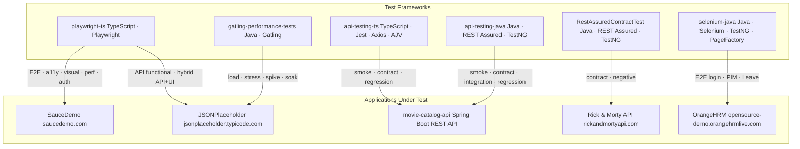
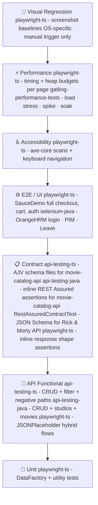
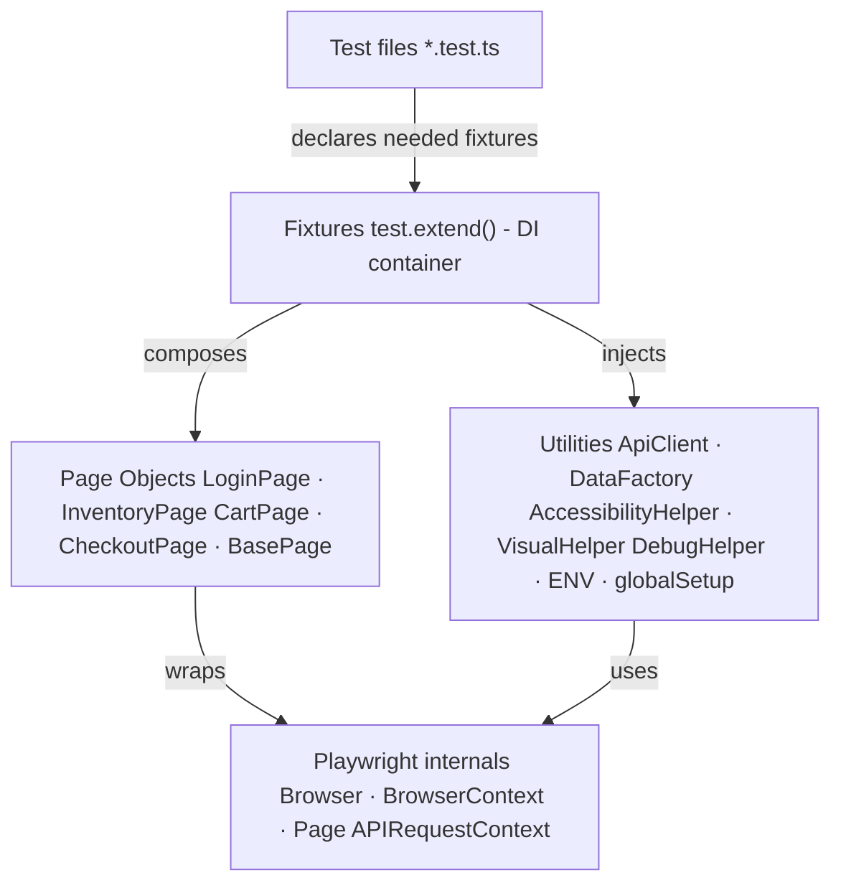
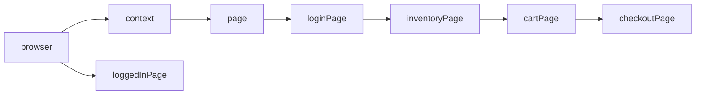
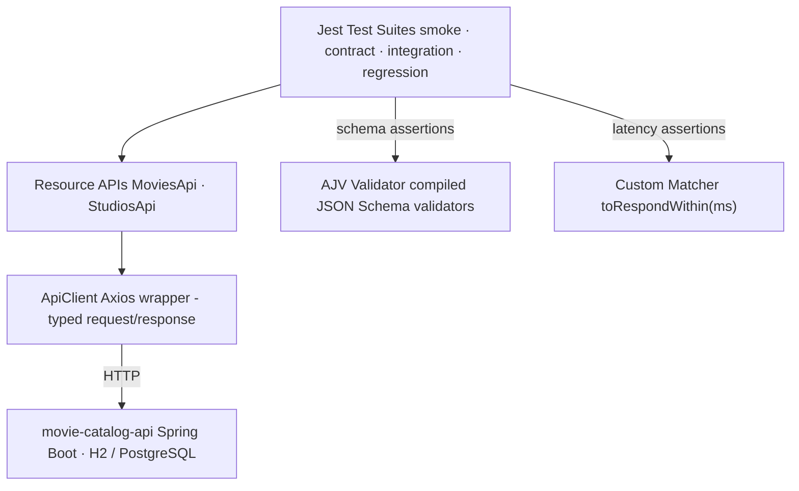
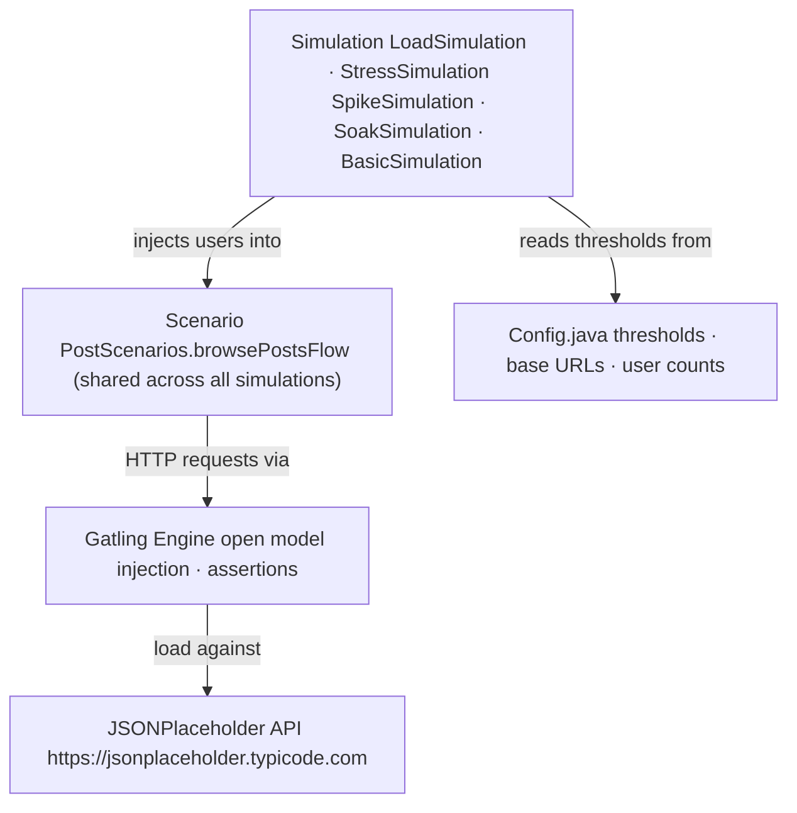

# System Architecture

## Portfolio map

Six projects, five tools, four applications under test. This diagram shows how they all relate.

---

## Testing pyramid - portfolio view

Each layer of the pyramid is covered by at least one project. No layer is covered by only one tool.

---

## playwright-ts internal architecture

The most complex project in the portfolio. All layers compose through Playwright's `test.extend()` fixture system.

### Fixture composition

Fixtures are declared as dependencies of each other, not of the test. A test that needs `checkoutPage` automatically gets `inventoryPage`, `cartPage`, `loginPage`, `page`, and `browser` - without declaring them.

`loggedInPage` is the exception - it bypasses the login flow by loading a persisted storage state (`.auth/sauce.json`), giving tests a pre-authenticated `InventoryPage` with no login overhead.

---

## api-testing-ts internal architecture

---

## Gatling internal architecture

The scenario is the only moving part shared across simulations. Changing the load profile (ramp shape, user count, duration) is the simulation's only responsibility - test logic lives in the scenario.

---

## Design decisions

### Why fixtures over setup/teardown hooks

TestNG and JUnit use `@BeforeMethod` / `@AfterMethod` hooks that run sequentially and share state through instance variables. Playwright fixtures are lazily instantiated, scoped per-test, and compose declaratively. A test that needs `cartPage` declares it; a test that needs only `loginPage` never pays the cost of initialising `cartPage`. This eliminates the class of bug where a `@BeforeMethod` runs too much setup for tests that don't need it.

### Why separate Jest configs instead of tags

Jest's `--testPathPattern` can filter by file path, but it requires the caller to know the pattern. Four named config files (`jest.smoke.config.js`, `jest.contract.config.js`, etc.) make the intent explicit - `npm run test:smoke` is unambiguous, portable across CI systems, and doesn't require knowledge of the directory structure.

### Why Java for Gatling and REST Assured

Gatling simulations and REST Assured tests are code, not configuration files. The Java Gatling DSL and REST Assured's fluent `given/when/then` are idiomatic in a Java ecosystem. Keeping performance and contract tests in Java alongside potential backend test infrastructure avoids context-switching for teams that also maintain Java services.

### Why AJV schema files over inline assertions

Inline assertions like `expect(response.data.mid).toBe('number')` scale linearly - every new field needs a new assertion. AJV compiles a JSON Schema once and validates the entire object tree in one call. The schema file is also shareable with the backend team as a machine-readable contract document, independently of the test code.
