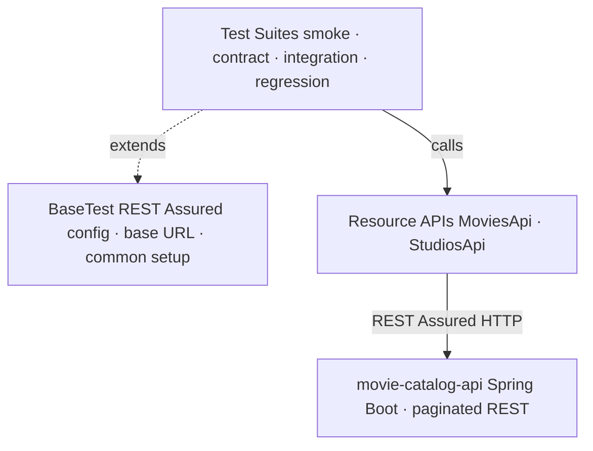
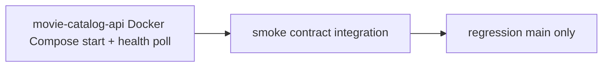

# API Testing Strategy - api-testing-java

**Project:** [`api-testing-java`](https://github.com/EnesAkyel/api-testing-java)  
**Stack:** Java 21 · REST Assured · TestNG · Allure · Maven  
**Target app:** [`movie-catalog-api`](https://github.com/EnesAkyel/movie-catalog-api) (Spring Boot REST API)

---

## Purpose

A Java-native API testing framework that covers the same `movie-catalog-api` target as `api-testing-ts`, but from a Java toolchain perspective. It demonstrates how to structure typed, schema-aware REST Assured tests with group-based suite separation - a pattern common in Java QA organisations.

It sits alongside `api-testing-ts` in the portfolio as the Java counterpart, covering the same endpoints and test types using a different language, test runner, and assertion style.

---

## Architecture

`MoviesApi` and `StudiosApi` encapsulate REST Assured request builders. Test files call resource methods rather than writing `given().when().then()` chains inline - the HTTP details are in one place.

---

## Suite Separation

Tests are divided into four groups, each runnable independently via Maven's `-Dgroups` flag:

| Group         | What it covers                                        | When it runs       |
|---------------|-------------------------------------------------------|--------------------|
| `smoke`       | API reachability - status 200 for key endpoints       | Every push + PR    |
| `contract`    | Response shape - field presence, types, schema        | Every push + PR    |
| `integration` | Full CRUD - create, read, update, delete with cleanup | Every push + PR    |
| `regression`  | Full suite - all of the above, verbose output         | `main` branch only |

CI runs smoke → contract → integration in sequence. If smoke fails, the API is unreachable and the rest are skipped immediately.

---

## What Is Tested

### Movies API (`/api/v1/movies`)
- `GET /movies` - status 200, paginated envelope, `Movie[]` items
- `GET /movie/:mid` - single `Movie` schema, field types
- `POST /movie` - create, response validates schema, cleanup in `afterAll`
- CRUD lifecycle with fixed IDs to avoid collisions with fixture data

### Studios API (`/api/v1/studios`)
- `GET /studios` - status 200, `Studio[]` schema
- `GET /studio/:id` - single studio, field types
- `POST /studio` - create with cleanup

### Cross-cutting
- Status code assertions on all requests
- Response body field validation
- Negative paths - 404 on missing resource, error message shape

---

## Tool Choices

**REST Assured over OkHttp / HttpClient** - REST Assured's `given/when/then` DSL reads as a readable specification of intent. `body("fieldName", equalTo(...))` assertions integrate with Hamcrest matchers that TestNG already uses, making the stack consistent.

**TestNG over JUnit** - consistent with `selenium-java` and `RestAssuredContractTest`. Group-based filtering (`-Dgroups=smoke`) maps cleanly to CI stages without separate config files.

**Allure** - step-level traceability for API test failures. `@Step` annotations on resource methods make the report readable: instead of a raw stack trace, the failure shows which endpoint was called and what response was received.

---

## CI Pipeline

**Application startup** - the pipeline checks out `movie-catalog-api` alongside the test repo, runs `docker compose up -d --build`, and polls `GET /movies` every 5 seconds for up to 150 seconds before running any tests. This prevents REST Assured requests from hitting a partially initialized Spring Boot application.

**Regression gate** - regression runs on `main` only after the smoke/contract/integration job passes. Pull requests get full coverage without the longer regression run.

---

## Comparison with `api-testing-ts`

| Aspect            | `api-testing-java`                     | `api-testing-ts`                             |
|-------------------|----------------------------------------|----------------------------------------------|
| Language          | Java                                   | TypeScript                                   |
| HTTP client       | REST Assured                           | Axios (typed wrapper)                        |
| Schema validation | Field-by-field Hamcrest assertions     | AJV compiled JSON Schema files               |
| Test runner       | TestNG                                 | Jest                                         |
| Suite separation  | `@Test(groups = "smoke")` + `-Dgroups` | Separate Jest config files                   |
| Reporting         | Allure via Maven                       | HTML reporter + JUnit XML                    |
| Contract approach | Inline assertions                      | Schema files shareable as contract documents |

Both projects cover the same target API. `api-testing-java` demonstrates the Java ecosystem approach; `api-testing-ts` demonstrates typed schema-file contracts. The comparison highlights the tradeoff: Java's inline assertions are explicit and readable; TypeScript's AJV schema files are a single source of truth that scales better as the API grows.
