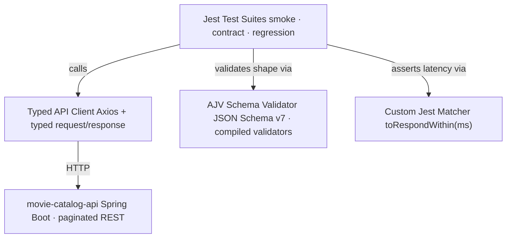

# API Testing Strategy - TypeScript

**Project:** [`api-testing-ts`](https://github.com/EnesAkyel/api-testing-ts)  
**Stack:** TypeScript · Jest · Axios · AJV · jest-junit · jest-html-reporters  
**Target app:** [`movie-catalog-api`](https://github.com/EnesAkyel/movie-catalog-api) (Spring Boot REST API)

---

## Purpose

This framework provides typed, schema-validated API tests for a self-owned Spring Boot application. Because the application and the tests are owned by the same author, the framework goes beyond status code assertions into **contract enforcement** - verifying that the API response shape never silently changes between releases.

---

## Architecture

The `ApiClient` wraps Axios and returns typed response objects. Test files never import Axios directly - all HTTP details are encapsulated in resource-specific clients (`MoviesApi`, `StudiosApi`). This means if an endpoint URL or authentication header changes, the fix is in one place.

---

## Suite Separation

Jest is configured with **four separate config files**, each targeting a distinct subset of tests. This makes it possible to run the cheapest and most targeted tests first without pulling in the full suite.

| Config                       | Tag / Pattern                 | When to run                                          |
|------------------------------|-------------------------------|------------------------------------------------------|
| `jest.smoke.config.js`       | `smoke/` directory            | Every deploy - verifies the API is up and responds   |
| `jest.contract.config.js`    | `contract/` directory         | Every PR - validates response shapes haven't changed |
| `jest.integration.config.js` | `*.test.ts` root              | Full CRUD coverage including setup/teardown          |
| `jest.regression.config.js`  | `regression-tests/` directory | Pre-release - full suite with verbose output         |

The smoke suite runs in seconds. The regression suite is the full picture and runs with `--verbose` to produce readable CI output.

---

## Contract Testing with AJV

Contract tests use AJV to compile a JSON Schema once and validate every response object against it. The choice of AJV over plain `expect` field checks is intentional:

- **Single source of truth** - the schema file defines the contract. Adding a field to the schema automatically covers it in all tests.
- **Deep validation** - nested objects and arrays are validated recursively. A missing `studio` field inside a paginated `content` array item is caught, not silently passed.
- **Error messages** - AJV reports exactly which field failed and why, reducing diagnosis time.

Example: `GET /movies` returns a paginated wrapper. The contract test validates both the envelope (`totalElements`, `page`, `size`, `totalPages`) and every item in `content` against the `Movie` schema individually.

---

## What Is Tested

### Movies API
- `GET /movies` - status 200, paginated envelope, `Movie[]` schema, filtering by genre / rating / price range
- `GET /movie/:mid` - status 200, single `Movie` schema, field types
- `POST /movie` - create, response matches schema, cleanup in `afterAll`
- `PUT /movie/:mid` - update, response reflects changes
- `DELETE /movie/:mid` - 200 on delete, 404 on re-fetch

### Studios API
- `GET /studios` - status 200, `Studio[]` schema
- `GET /studio/:id` - single studio schema
- `POST /studio` - create with cleanup

### Cross-cutting
- Response time threshold - every test uses the custom `toRespondWithin(config.responseTimeThresholdMs)` matcher, making latency a first-class assertion rather than an afterthought
- Schema drift detection - contract tests catch any field rename, type change, or removal before it reaches consumers

---

## Test Data

Tests that write data (`POST`, `PUT`, `DELETE`) use fixed IDs in the `5000+` range (e.g., `mid: 5001`, `mid: 5099`) to avoid colliding with seeded fixture data. A `beforeAll` deletes the record if it exists from a previous failed run, and `afterAll` cleans it up - tests leave no side effects.

---

## Tool Choices

**Jest over Mocha/Vitest** - Jest's suite isolation (`--projects`) and built-in parallel runner map cleanly to the four config files. `ts-jest` provides TypeScript compilation without a separate build step.

**Axios over `fetch`** - Axios normalises error handling (non-2xx throws rather than requiring manual `response.ok` checks), and its interceptor model makes adding auth headers or request logging centralized.

**AJV over Zod/Yup** - AJV validates standard JSON Schema files, which can be shared with the backend team as the agreed contract. Zod and Yup are TypeScript-first and less portable across language boundaries.

**jest-junit + jest-html-reporters** - JUnit XML feeds CI dashboards (GitHub Actions test summaries). The HTML reporter provides a self-contained local report without a separate server.
