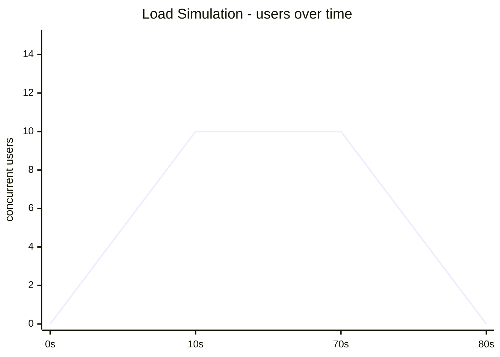

# Performance Testing Strategy - Gatling

**Project:** [`gatling-performance-tests`](https://github.com/EnesAkyel/gatling-performance-tests)  
**Stack:** Java · Gatling 3 · Maven  
**Target:** JSONPlaceholder REST API (`https://jsonplaceholder.typicode.com`)

---

## Purpose

Functional tests verify that an endpoint returns the right data. Performance tests verify that it does so under load, over time, and without degrading. This framework answers four distinct questions, each requiring a different load profile:

1. **Load** - does the system hold up under expected production traffic?
2. **Stress** - at what point does the system break, and how does it recover?
3. **Spike** - can the system absorb sudden, sharp bursts of traffic?
4. **Soak** - does performance degrade over an extended period (memory leaks, connection pool exhaustion)?

Each question maps to a separate Gatling simulation. Running them in sequence gives a complete picture of system behavior across all traffic patterns.

---

## Simulation Design

### Shared Scenario

All simulations inject the same scenario - `PostScenarios.browsePostsFlow` - so the load profile is the only variable between runs. This makes simulation results directly comparable: any difference is caused by the load shape, not by a different user journey.

### Load Profiles

| Simulation | Profile                                                                   | Question answered                                               |
|------------|---------------------------------------------------------------------------|-----------------------------------------------------------------|
| **Basic**  | 1 user, single request                                                    | Baseline - is the endpoint reachable and responding correctly?  |
| **Load**   | Ramp 5→10 users/s over 10s · hold 60s · ramp down                         | Steady-state production traffic                                 |
| **Stress** | Incremental peaks: 10→20→30→40→50 users injected via `stressPeakUsers`    | Breaking point - where do errors or latency spikes begin?       |
| **Spike**  | Baseline 5/s · instant 50 users · baseline · instant 100 users · baseline | Resilience to flash events (marketing campaigns, viral traffic) |
| **Soak**   | Ramp to 10 users/s · hold for 5 minutes · ramp down                       | Memory and resource stability over sustained load               |

---

## Thresholds

Global assertions are defined in `Config.java` and applied in every simulation that uses them:

| Metric            | Threshold   | Rationale                                                     |
|-------------------|-------------|---------------------------------------------------------------|
| Max response time | < 60,000 ms | Absolute ceiling - any response slower than this is a failure |
| 95th percentile   | < 1,500 ms  | The experience for 95% of users must be under 1.5s            |
| Success rate      | > 99%       | At most 1% error rate under normal load                       |

Spike and stress simulations relax the max response time ceiling (to 20s and 100s respectively) because their purpose is to find the breaking point, not to enforce production SLAs.

---

## Tool Choice

**Gatling over JMeter** - Gatling simulations are code (Java/Scala/Kotlin), not XML. They are version-controlled, reviewable in a pull request, and composable. JMeter's GUI-generated XML is difficult to diff and review. Gatling's DSL is also expressive enough to model complex user journeys with conditional logic, feeders, and loops without workarounds.

**Gatling over k6** - k6 is excellent for teams already in a JavaScript/TypeScript ecosystem. This framework sits alongside Java-based projects (`RestAssuredContractTest`, `api-testing-java`), so Java Gatling keeps the toolchain consistent. The Gatling HTML report and assertion model are also well-suited for on-demand local runs without a metrics backend.

---

## What Is Not Covered

- **UI performance** - browser-level metrics (DOMContentLoaded, LCP, CLS) are out of scope for Gatling. Those are covered by `playwright-ts` using the Navigation Timing API and `performance.memory`.
- **Distributed load generation** - simulations run from a single machine. For production-scale load that requires multiple injectors, Gatling Enterprise or a cloud load tool would be needed.
- **Database performance** - response time assertions cover the full stack but cannot isolate whether slowdowns originate in the application layer or the database.
