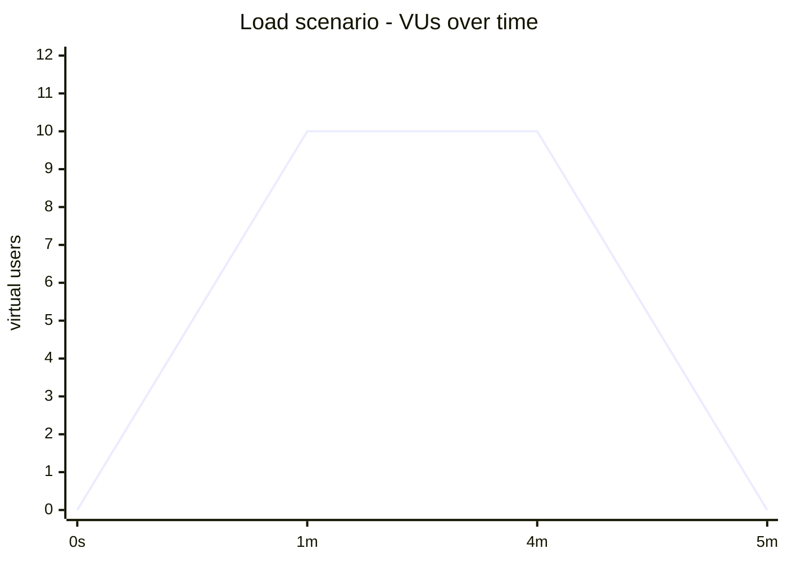

# Performance Testing Strategy - k6

**Project:** [`k6-performance-tests`](https://github.com/EnesAkyel/k6-performance-tests)  
**Stack:** TypeScript · k6 · Node.js 24 · esbuild  
**Target:** [`movie-catalog-api`](https://github.com/EnesAkyel/movie-catalog-api) (self-owned Spring Boot REST API)

---

## Purpose

Where `gatling-performance-tests` targets a public API (JSONPlaceholder) to demonstrate load simulation mechanics, this suite targets the self-owned `movie-catalog-api` - making threshold failures actionable. If a latency threshold is breached here, the problem is in code we control and can fix.

The suite answers four questions:

1. **Smoke** - do all endpoints respond correctly under minimal load before running anything heavier?
2. **Load** - does the API sustain normal traffic without degrading?
3. **Stress** - at what VU count do latency or error thresholds break?
4. **Spike** - does the API absorb a sudden burst and recover to baseline?

---

## Scenario Design

TypeScript is transpiled to CommonJS via esbuild and executed by the k6 runtime. All four scenarios share the same `BASE_URL` config, which is injected as an environment variable (`-e BASE_URL=...`) so CI and local runs target the same endpoints without code changes.

### Load Profiles

| Scenario | VU Shape                  | Duration | p95 Threshold | Error Rate |
|----------|---------------------------|----------|---------------|------------|
| smoke    | 1 VU flat                 | 30s      | < 500ms       | < 1%       |
| load     | 0 → 10 → 0                | 5m       | < 800ms       | < 1%       |
| stress   | 0 → 10 → 20 → 30 → 40 → 0 | ~38m     | < 2,000ms     | < 5%       |
| spike    | 1 → 100 → 1               | ~8m      | < 2,000ms     | < 10%      |

### Endpoints Under Test

| Method | Path                           | Scenarios      |
|--------|--------------------------------|----------------|
| GET    | `/api/v1/movies`               | all            |
| GET    | `/api/v1/movies?genre=Action`  | smoke, load    |
| GET    | `/api/v1/movies?page=0&size=5` | load           |
| GET    | `/api/v1/studios`              | smoke, load    |
| GET    | `/api/v1/movie/9999`           | smoke (404)    |

The load scenario uses k6 `group()` blocks to isolate `movies` and `studios` latency in reports and apply per-group thresholds.

---

## Thresholds

Thresholds are defined inline per scenario, not in a shared config, because each scenario has a different performance contract:

- **Smoke** enforces tight SLAs (`p95 < 500ms`, `error rate < 1%`) - under 1 VU the API should be fast.
- **Load** enforces normal production SLAs (`p95 < 800ms`) - 10 concurrent users is realistic traffic.
- **Stress and spike** relax thresholds significantly - their purpose is to find the breaking point, not enforce SLAs.

A threshold failure in the `smoke` or `load` scenario is a genuine regression signal. A failure in `stress` at 40 VUs is expected behavior that documents the system's limits.

---

## Tool Choice

**k6 over Gatling for this target** - `movie-catalog-api` is a TypeScript-adjacent project (the test suites `api-testing-ts` already use TypeScript). k6 keeps the performance layer in the same language ecosystem, making it easier to share type definitions and config patterns across test layers. Gatling (Java) was the right choice for the portfolio's Java-side projects.

**k6 over JMeter** - k6 test scripts are code, not XML. They are version-controlled, reviewable in a pull request, and bundleable. JMeter's GUI-generated `.jmx` files are difficult to diff and review meaningfully.

**esbuild over webpack** - esbuild bundles all four scenario files in under a second. The webpack-based k6 template works but adds significant configuration overhead for no meaningful benefit at this project's scale.

**Both k6 and Gatling in the portfolio** - having both demonstrates breadth across the two most common code-first load testing tools. They target different applications (movie-catalog-api vs JSONPlaceholder) and different language ecosystems (TypeScript vs Java), making them complementary rather than redundant.

---

## What Is Not Covered

- **Soak testing** - not included because sustained load against a self-hosted API in CI would require a long-running job (20+ minutes). A soak scenario can be added as a manually-triggered workflow input if needed.
- **Write path (POST/PUT/DELETE)** - load scenarios target read endpoints only. The write path requires careful test-data management (unique IDs, cleanup) that adds complexity out of scope for a load suite. Functional correctness of writes is covered by `api-testing-ts` and `api-testing-java`.
- **Distributed load generation** - scenarios run from a single CI runner. Grafana Cloud k6 would be needed for multi-region or production-scale load.