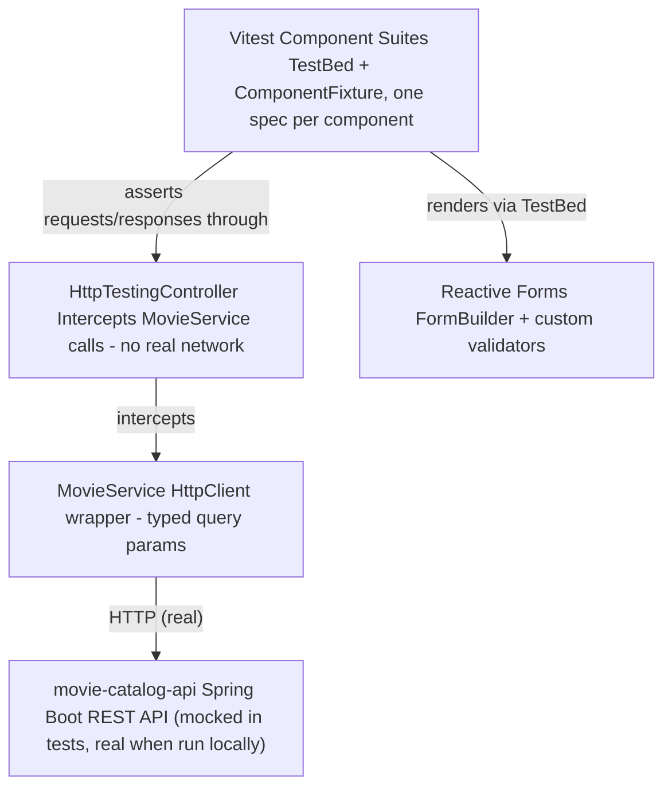

# UI Test Strategy - movie-catalog-ui

**Project:** [`movie-catalog-ui`](https://github.com/EnesAkyel/movie-catalog-ui)
**Stack:** Angular 22 (standalone components) · TypeScript 6.0 · Vitest · `@vitest/coverage-v8` · Reactive Forms
**Target app under test (self):** `movie-catalog-ui` itself, backed by [`movie-catalog-api`](https://github.com/EnesAkyel/movie-catalog-api) (Spring Boot + PostgreSQL)

---

## Purpose

Unlike the other projects in this portfolio, `movie-catalog-ui` is not a test framework pointed at someone else's application - it is the **application itself**, built by the same author, with its own component-level test suite and, deliberately, locator-friendly markup for a planned Playwright E2E layer on top. It fills the "unit / component" base of the pyramid for a real Angular app rather than a demo site, and it is the first project in the portfolio where the author controls both the code under test and the tests themselves at the UI layer.

---

## Architecture

Every component that talks to the backend does so exclusively through `MovieService`. Tests never let a real HTTP request escape - `provideHttpClientTesting()` + `HttpTestingController` intercept every call, assert on method/URL/params/body, and `flush()` a controlled response. `httpMock.verify()` in `afterEach` fails the test if any expected request wasn't made, which catches dead code paths as a side effect of catching missed assertions.

---

## What Is Tested

### `MovieService` (`movie-service.spec.ts`)
- Every method (`getAllMovies`, `getMovieByMID`, `deleteMovie`, `addMovie`, `updateMovie`, `getStudios`) asserted for HTTP method, URL, and query params/body
- Query-param building logic - only set params are included, `0` is treated as a real value (not falsy-skipped), `getStudios` always requests `size=100`

### `ListComponent` (`list-component.spec.ts`, largest suite)
- Search/filter debounce pipeline - `vi.useFakeTimers()` + `vi.advanceTimersByTime(300)` to assert the 300ms debounce fires exactly once per settled input, not once per keystroke
- Sort behavior - ascending on first click, direction toggles on repeat-click of the active column, switching columns resets to ascending, and the current sort re-applies after a fresh page loads (not hardcoded to a single column)
- Empty-state row (`no-search-results`) rendered when a search/filter combination matches nothing
- Pagination boundary conditions (prev/next disabled at page 0 / last page)

### `AddMovie` (`add-movie.spec.ts`, add + edit modes)
- Client-side reactive-forms validation mirrors backend constraints (pattern, min/max, required) per field
- Server-side validation surfaced back into the form (e.g. `badMID` when the backend rejects a duplicate MID)
- **Error display timing** - errors must stay hidden while a field is only `dirty`, and only appear once the field is `touched` (blurred). This is asserted explicitly with `markAsDirty()` vs. `markAsTouched()`, because `FormControl.setValue()` alone marks neither

### `GenreNavbar` (`genre-navbar.spec.ts`)
- Active-state highlighting (`[class.active]`) reflects the current route's genre param
- "All" link clears the genre filter

### `MovieDetail`, `SearchPipe`, `CustomValidator`
- Detail view resolves a movie's `studio` id to a studio name via a second service call, and distinguishes a 404 ("movie doesn't exist") from a generic error
- Pipe-level filtering logic (by name or MID, case-insensitive) tested in isolation from any component
- `CustomValidator.isNumber` - the one shared reactive-forms validator so far - tested as a pure function against numeric strings, numeric values, non-numeric strings, empty string, and null

---

## Test Data & Isolation

No test hits the real backend. Every spec that needs `MovieService` provides `provideHttpClient()` + `provideHttpClientTesting()` and drives responses explicitly via `httpMock.expectOne(...).flush(...)`. This means:

- Tests are deterministic and fast (`ng test --watch=false` runs the full suite in-process, no server to start)
- Backend downtime or schema drift in `movie-catalog-api` cannot make a UI unit test flaky
- Component tests focus on UI logic (form state, sort/filter/debounce behavior, conditional rendering) rather than re-proving the API contract, which is `api-testing-ts`'s / `api-testing-java`'s job against the same backend

---

## Tool Choices

**Vitest over Jasmine/Karma** - Angular 22's default `@angular/build:unit-test` builder runs on Vitest. Karma requires a real browser (or headless Chrome) per run and is markedly slower for a component-level suite this size; Vitest runs in Node via `jsdom` with no browser process to manage in CI.

**`HttpTestingController` over a mocking library** - it's Angular's own testing utility, purpose-built for `HttpClient`, and its `expectOne` + `flush` + `verify` pattern makes an unasserted or unexpected request a hard test failure rather than a silent pass.

**Fake timers for debounce testing** - the search/filter pipeline is genuinely debounced (`debounceTime(300)`) in production code. Testing it with real timers would either slow the suite down or require brittle real-time waits; `vi.useFakeTimers()` lets the test assert the debounce boundary precisely (n-1 ms: no request, n ms: one request).

**SonarCloud** - `sonar-project.properties` feeds `coverage/movie-catalog-ui/lcov.info` (produced by `npm run test:coverage`) into SonarCloud for coverage tracking and static analysis (duplication, code smells) alongside the CI pipeline, giving this project the same code-quality gate the CI-only projects rely on manual review for.

---

## Design for Testability (built for the next layer)

`movie-catalog-ui` was deliberately built to be a good Playwright target before any Playwright test exists against it:

- **`data-testid`** on every interactive element and validation/status message, kebab-case, dynamic ones suffixed by entity id (`movie-link-1001`, `delete-movie-1001`)
- **Real `<button>` elements** for actions instead of `<a (click)>`, so role-based locators (`getByRole('button', { name })`) work without workarounds
- **`role="alert"` / `aria-live="polite"`** on success/error notifications, so an E2E test can assert on them without an arbitrary wait
- **An inline Yes/No delete confirmation** instead of a single irreversible click, giving a real confirm/cancel flow to drive

This is intentional groundwork, not incidental: the component suite here proves the UI logic is correct in isolation, and the markup conventions mean the eventual E2E layer can reuse the same `data-testid` values the component tests already assert against.

---

## Planned: E2E Layer

`movie-catalog-ui` + `movie-catalog-api` running together (`docker compose up` in the API repo) is the intended target for a forthcoming Playwright E2E suite - full user journeys (add → search → filter → sort → edit → delete) exercised end-to-end against a real backend, complementing the component-level suite documented here and the API-level suites in `api-testing-ts` / `api-testing-java`. Until that suite exists, end-to-end coverage of this application is a known, accepted gap (see [Risk Areas](risk-areas.md) and [Coverage Matrix](coverage-matrix.md)).

---

## CI Pipeline

`.github/workflows/ci.yml` runs four jobs on every push/PR to `main`:

1. **format** - `npm run format:check` (Prettier, Angular HTML parser)
2. **build** - `npm run build`
3. **test** - `npm run test:coverage`, coverage uploaded as a build artifact
4. **sonar** (after the three above pass) - downloads the coverage artifact, runs the SonarCloud scan

Node version is pinned via `.nvmrc` and read by `actions/setup-node` in every job, keeping local dev and CI on the same Angular-22-compatible Node/TypeScript toolchain.
