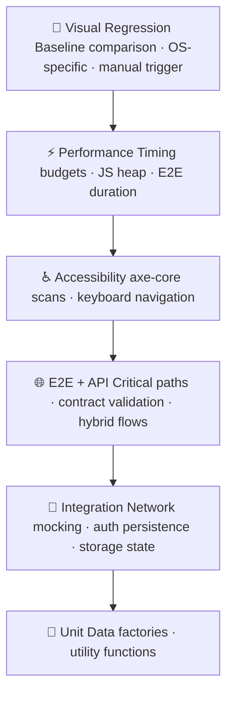

# Test Strategy

## Philosophy

Testing is a risk management activity, not a coverage metric. The goal is to catch the failures that matter - broken checkouts, inaccessible pages, degraded performance, broken API contracts - before they reach users. Every layer of the test suite exists because it catches a class of defect that the layers below it cannot.

This strategy follows a **risk-weighted testing pyramid**: broad at the unit level for fast feedback, narrow at the E2E level for confidence in critical paths, and supplemented with specialist layers (accessibility, visual, performance) that catch regressions no functional test will find.

The pyramid shape reflects investment, not importance. Unit tests run in milliseconds and give immediate feedback. E2E tests are slower and more expensive to maintain - they are written only for flows where a failure would have real business impact.

---

## Scope

### Applications under test

| App                                                     | Purpose in the suite                                         |
|---------------------------------------------------------|--------------------------------------------------------------|
| [SauceDemo](https://www.saucedemo.com)                  | Primary UI target - login, inventory, cart, checkout         |
| [JSONPlaceholder](https://jsonplaceholder.typicode.com) | Public REST API - used for API layer and hybrid API+UI tests |

### What is tested

- **Authentication** - login with valid/invalid/empty credentials, session persistence via storage state
- **Core user journeys** - full checkout flow, cart management, product sorting
- **Form validation** - negative paths, error message content and visibility
- **API contracts** - response shape, status codes, CRUD operations
- **Hybrid flows** - API state setup verified through UI (and vice versa)
- **Network behavior** - request interception, payload validation, error simulation
- **Accessibility** - axe-core scans per page, keyboard-only navigation
- **Performance** - page load timing, JS heap size, end-to-end checkout duration
- **Visual integrity** - pixel-level baseline comparison for key pages and components
- **Multi-tab behavior** - popup handling, state preservation across windows

### What is not tested

| Area                   | Reason                                                                                      |
|------------------------|---------------------------------------------------------------------------------------------|
| Backend / server logic | SauceDemo is a third-party demo app - no server access                                      |
| Database state         | No DB access; API layer covers data contracts                                               |
| Load / stress testing  | Out of scope for this framework; would require a dedicated tool (e.g., Gatling, k6)         |
| Mobile native apps     | Web responsive layout covered via viewport config; native apps require a separate framework |
| Security testing       | Addressed separately; not the responsibility of the functional test suite                   |

---

## Tool Choices

### Playwright

Chosen over Selenium and Cypress for three reasons:

1. **Native multi-browser support** - Chromium, Firefox, and WebKit ship in a single package with a unified API. No per-browser driver management.
2. **Auto-waiting** - Playwright waits for elements to be actionable before interacting. This eliminates the majority of flaky `waitFor*` calls that plague Selenium suites.
3. **First-class API testing** - `APIRequestContext` is built in, making hybrid API+UI tests a single import away rather than requiring a separate HTTP library.

### TypeScript

Type safety on test code catches selector typos, wrong argument orders, and missing fixture declarations at compile time rather than at runtime in CI. The `@playwright/test` types are excellent - page object method signatures, fixture types, and config options are all fully typed.

### Faker.js

Every test run uses freshly generated data - names, emails, addresses. This prevents tests from depending on pre-existing state and makes them safe to run in parallel without data collisions.

### Playwright MCP (`@playwright/mcp`) - _in progress_

`@playwright/mcp` exposes a Model Context Protocol server that lets an AI agent drive a real Playwright browser. The package is added to the project but integration is ongoing - MCP tooling is not yet wired into the test suite or CI.

### axe-core (`@axe-core/playwright`)

Accessibility is validated at the tool level, not by manual inspection. axe-core runs WCAG 2.1 AA rules against a rendered DOM and reports violations with impact levels (`critical`, `serious`, `moderate`, `minor`). This is not a substitute for manual a11y review but catches the class of issues that are consistently automatable.

### Allure

Chosen over the built-in HTML reporter for three capabilities: structured test metadata (`epic`, `feature`, `story`, `severity`) that makes large suites navigable, history trending across runs (pass rate, flakiness, duration drift), and step-level detail that makes failure diagnosis faster without needing a trace file.

---

## Test Data Strategy

No hardcoded strings in test bodies. Two mechanisms:

1. **`DataFactory`** - Faker.js-backed builders for user profiles, form data, and API payloads. Each call generates fresh values.
2. **Auth storage state** - the `auth-setup` project runs once and writes a browser storage state file (`.auth/sauce.json`). Tests that need an authenticated session consume it via the `loggedInPage` fixture rather than repeating the login flow.

---

## Environment Strategy

Tests run against three environments controlled by the `ENV` variable:

| Environment | Purpose                                             | Timeout |
|-------------|-----------------------------------------------------|---------|
| `dev`       | Active development - fast feedback                  | 30s     |
| `staging`   | Pre-release validation - mirrors prod config        | 60s     |
| `prod`      | Smoke check only - minimal footprint on live system | 60s     |

Environment-specific URLs and credentials are stored in `.env.dev`, `.env.staging`, `.env.prod`. Local overrides go in `.env.local` (gitignored). CI reads from GitHub Secrets and resolves the correct set at runtime.

---

## Tagging and Filtering

Every test carries one or more tags that determine when it runs:

| Tag            | Meaning                                                   | Runs in CI            |
|----------------|-----------------------------------------------------------|-----------------------|
| `@smoke`       | Minimal sanity - login, page load, key element visibility | Every push            |
| `@regression`  | Full functional suite                                     | Every push (sharded)  |
| `@e2e`         | Multi-step user journeys                                  | Part of `@regression` |
| `@api`         | API-only tests                                            | Part of `@regression` |
| `@a11y`        | Accessibility scans                                       | Part of `@regression` |
| `@performance` | Timing and memory budgets                                 | Part of `@regression` |
| `@visual`      | Screenshot baseline comparison                            | Manual trigger only   |
| `@unit`        | Utility and factory tests                                 | Part of `@regression` |

Visual tests are excluded from the automated regression suite because they require committed baseline files that are OS-specific. Running them in CI without matching baselines produces false failures.

---

## Flakiness Policy

A test that fails intermittently without a code change is a liability, not an asset. The policy:

- CI is configured with `retries: 2` on failure - a test must fail three consecutive times to be counted as a real failure
- Intermittently failing tests are tagged `@flaky` and routed to a quarantine project that runs separately from the main regression suite
- A quarantined test must be fixed or deleted within two sprints - it does not stay quarantined indefinitely
- `waitForTimeout` is banned (`playwright/no-wait-for-timeout` ESLint rule is set to `warn`). Timing-based waits are the primary source of flakiness and are replaced with web-first assertions

---

## Definition of Done (for a test)

A test is considered complete when:

- [ ] It tests one thing - a single behavior or assertion per test, not a scenario chain
- [ ] It carries the correct tags
- [ ] It uses a page object for all locators - no raw selectors in the test body
- [ ] It uses `DataFactory` or storage state for test data - no hardcoded strings
- [ ] It passes lint and format checks (`npm run lint && npm run format:check`)
- [ ] It passes in CI on both Chromium and Firefox (where applicable)
- [ ] Failure output is self-explanatory - the error message names what was expected and what was found
