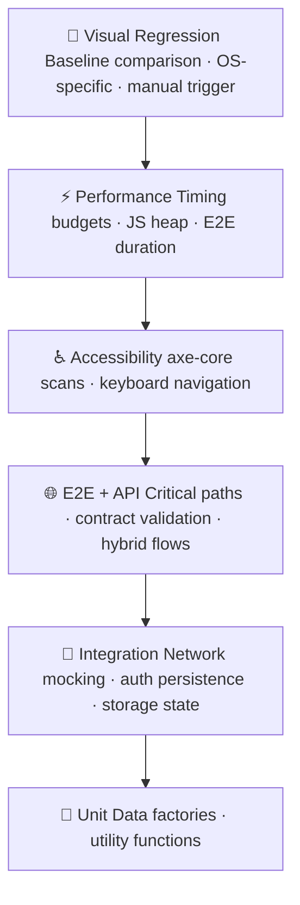

# Test Strategy

## Philosophy

Testing is a risk management activity, not a coverage metric. The goal is to catch the failures that matter - broken checkouts, inaccessible pages, degraded performance, broken API contracts - before they reach users. Every layer of the test suite exists because it catches a class of defect that the layers below it cannot.

This strategy follows a **risk-weighted testing pyramid**: broad at the unit level for fast feedback, narrow at the E2E level for confidence in critical paths, and supplemented with specialist layers (accessibility, visual, performance) that catch regressions no functional test will find.

```mermaid
flowchart TD
    A["🔺 Visual Regression Baseline comparison · OS-specific · manual trigger"]
    B["⚡ Performance Timing budgets · JS heap · E2E duration"]
    C["♿ Accessibility axe-core scans · keyboard navigation"]
    D["🌐 E2E + API Critical paths · contract validation · hybrid flows"]
    E["🔧 Integration Network mocking · auth persistence · storage state"]
    F["🧪 Unit Data factories · utility functions"]

    A --> B --> C --> D --> E --> F
```

The pyramid shape reflects investment, not importance. Unit tests run in milliseconds and give immediate feedback. E2E tests are slower and more expensive to maintain - they are written only for flows where a failure would have real business impact.

---

## Scope

### Applications under test

| App                                                                 | Purpose in the suite                                                                                                                                                                                                                    |
|---------------------------------------------------------------------|-----------------------------------------------------------------------------------------------------------------------------------------------------------------------------------------------------------------------------------------|
| [movie-catalog-ui](https://github.com/EnesAkyel/movie-catalog-ui)   | Primary E2E target - a self-owned Angular front end, chosen deliberately over a third-party demo site so the suite could drive an app built with its own testability conventions (see [movie-catalog-ui strategy](movie-catalog-ui.md)) |
| [movie-catalog-api](https://github.com/EnesAkyel/movie-catalog-api) | Backend the UI runs against; hit directly (not through the UI) for test-data seed/cleanup via `ApiClient`, and for the auth-setup project's storage-state capture                                                                       |

### What is tested

- **Authentication** - login with valid/invalid credentials (real backend and mocked 401), `authGuard` redirects on every protected route, session persistence via `storageState`
- **Core user journeys** - the movie catalog's CRUD paths: search/filter/sort/paginate, add a movie, delete with an inline (non-native) confirmation
- **Form validation** - client-side reactive-forms validation and server-side error mapping (mocked 400/409), negative paths, error message content and visibility
- **Test data seeding via API** - `ApiClient` creates/deletes disposable movies directly against `movie-catalog-api` so UI-driven delete/detail tests don't depend on or pollute shared seed data
- **Hybrid flows** - API-seeded state verified through the UI (create via `ApiClient`, delete via the UI's inline confirmation and assert the result)
- **Network behavior** - request interception/mocking, aborted requests, wildcard route patterns, request-count guards, artificial latency
- **Accessibility** - axe-core scans (critical-impact) per page, a keyboard-only login → search → detail → back flow
- **Performance** - page load timing, JS heap size (Chromium only), end-to-end add-movie round-trip duration
- **Visual integrity** - pixel-level baseline comparison, currently one element-level case (the add-movie form grid)
- **Multipage behavior** - a second page opened in the same authenticated `BrowserContext` reaches an authenticated route directly, proving auth state is context-scoped, not page-scoped

### What is not tested

| Area                       | Reason                                                                                                                   |
|----------------------------|--------------------------------------------------------------------------------------------------------------------------|
| Backend / server logic     | Covered by `api-testing-ts` / `api-testing-java` against the same `movie-catalog-api`, not duplicated here               |
| Database state             | No DB access; the API layer covers data contracts                                                                        |
| Load / stress testing      | Out of scope for this framework; covered for the same backend by `gatling-performance-tests` / `k6-performance-tests`    |
| Full WCAG audit            | axe-core scans check critical-impact violations on the four main pages, not every WCAG success criterion or impact level |
| Multi-tab / popup handling | `movie-catalog-ui` has no external links or `target="_blank"` anchors - there's no honest scenario to test this against  |
| Mobile native apps         | Web responsive layout covered via viewport config; native apps require a separate framework                              |
| Security testing           | Addressed separately; not the responsibility of the functional test suite                                                |

---

## Tool Choices

### Playwright

Chosen over Selenium and Cypress for three reasons:

1. **Native multi-browser support** - Chromium, Firefox, and WebKit ship in a single package with a unified API. No per-browser driver management.
2. **Auto-waiting** - Playwright waits for elements to be actionable before interacting. This eliminates the majority of flaky `waitFor*` calls that plague Selenium suites.
3. **First-class API testing** - `APIRequestContext` is built in, making hybrid API+UI tests a single import away rather than requiring a separate HTTP library.

### TypeScript

Type safety on test code catches selector typos, wrong argument orders, and missing fixture declarations at compile time rather than at runtime in CI. The `@playwright/test` types are excellent - page object method signatures, fixture types, and config options are all fully typed.

### Faker.js

Every test run uses freshly generated data - names, emails, addresses. This prevents tests from depending on pre-existing state and makes them safe to run in parallel without data collisions.

### Playwright MCP (`@playwright/mcp`) - _in progress_

`@playwright/mcp` exposes a Model Context Protocol server that lets an AI agent drive a real Playwright browser. The package is added to the project but integration is ongoing - MCP tooling is not yet wired into the test suite or CI.

### axe-core (`@axe-core/playwright`)

Accessibility is validated at the tool level, not by manual inspection. axe-core runs WCAG 2.1 AA rules against a rendered DOM and reports violations with impact levels (`critical`, `serious`, `moderate`, `minor`). This is not a substitute for manual a11y review but catches the class of issues that are consistently automatable.

### Allure

Chosen over the built-in HTML reporter for three capabilities: structured test metadata (`epic`, `feature`, `story`, `severity`) that makes large suites navigable, history trending across runs (pass rate, flakiness, duration drift), and step-level detail that makes failure diagnosis faster without needing a trace file.

---

## Test Data Strategy

No hardcoded strings in test bodies. Two mechanisms:

1. **`DataFactory`** - Faker.js-backed builders for user profiles, form data, and API payloads. Each call generates fresh values.
2. **Auth storage state** - the `auth-setup` project runs once and writes a browser storage state file (`.auth/moviecatalog.json`). Tests that need an authenticated session consume it via the `loggedInPage`/`loggedInContext` fixtures rather than repeating the login flow.

---

## Environment Strategy

No dev/staging/prod switching - there's no deployed multienvironment setup for `movie-catalog-ui`/`movie-catalog-api`, so the suite doesn't pretend there is one. `.env.local` (gitignored) holds `BASE_URL`, `API_URL`, credentials, and a single `TIMEOUT` for local runs. CI sets the same variables directly from GitHub Secrets and builds/boots both `movie-catalog-ui` and `movie-catalog-api` fresh in the runner (`boot-stack`) rather than pointing at a deployed instance - one less axis of config drift to debug. `globalSetup.ts` validates the required variables and checks HTTP reachability for both apps before any test runs.

---

## Tagging and Filtering

Every test carries one or more tags that determine when it runs:

| Tag           | Meaning                                               | Runs in CI                                          |
|---------------|-------------------------------------------------------|-----------------------------------------------------|
| `@smoke`      | Minimal sanity - login, a sort case, a successful add | Every push (part of `@regression`)                  |
| `@regression` | Full functional suite                                 | Every push, across a Chromium/Firefox/WebKit matrix |
| `@a11y`       | axe-core accessibility scans                          | Part of `@regression`                               |
| `@visual`     | Screenshot baseline comparison                        | Manual trigger only (`npm run test:visual`)         |

Visual tests are excluded from the automated regression suite because they require committed baseline files that are OS-specific. Running them in CI without matching baselines produces false failures.

`package.json` and `playwright.yml`'s `workflow_dispatch` dropdown also expose `api`/`unit` as selectable suites, carried over from an earlier iteration of this framework. No test in the current suite carries either tag - selecting them today runs zero tests. This is a known cleanup item, not a hidden capability.

---

## Flakiness Policy

A test that fails intermittently without a code change is a liability, not an asset. The policy:

- CI is configured with `retries: 2` on failure - a test must fail three consecutive times to be counted as a real failure
- `waitForTimeout` is discouraged (`playwright/no-wait-for-timeout` ESLint rule is set to `warn`). Timing-based waits are the primary source of flakiness and are replaced with web-first assertions or `page.clock` for deterministic timer control
- A dedicated `@flaky`-tag quarantine project (separate from the main regression run) is aspirational, not yet built - `playwright.config.ts` currently defines `auth-setup`, `chromium`, `firefox`, `webkit`, and `chromium-authenticated` only

---

## Definition of Done (for a test)

A test is considered complete when:

- [ ] It tests one thing - a single behavior or assertion per test, not a scenario chain
- [ ] It carries the correct tags
- [ ] It uses a page object for all locators - no raw selectors in the test body
- [ ] It uses `DataFactory` or storage state for test data - no hardcoded strings
- [ ] It passes lint and format checks (`npm run lint && npm run format:check`)
- [ ] It passes in CI across Chromium, Firefox, and WebKit (where applicable - e.g. `performance.memory` tests are Chromium-only by design)
- [ ] Failure output is self-explanatory - the error message names what was expected and what was found
