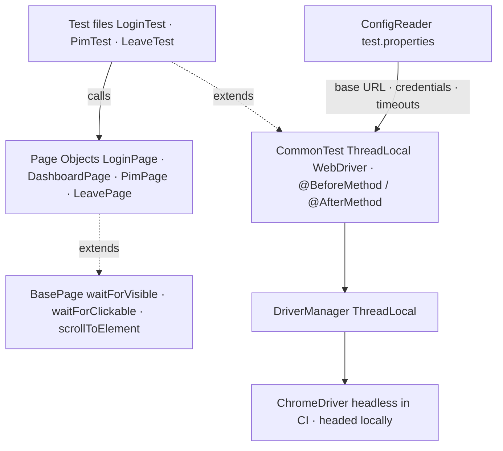
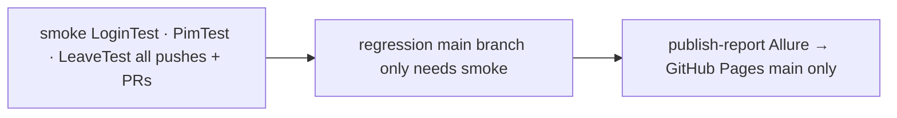

# UI Automation Strategy - selenium-java

**Project:** [`selenium-java`](https://github.com/EnesAkyel/selenium-java)  
**Stack:** Java 21 · Selenium WebDriver 4 · TestNG · PageFactory · AspectJ 1.9.25.1 · Allure · Maven Surefire  
**Target:** [OrangeHRM](https://opensource-demo.orangehrmlive.com) - open-source HR management system

---

## Purpose

A production-grade Selenium Java framework targeting a real HR application. It demonstrates how to structure a maintainable test suite in a Java ecosystem: PageFactory page objects, ThreadLocal driver management, retry logic, structured CI with separate smoke and regression pipelines, and Allure reporting with step-level traceability via AspectJ load-time weaving.

It sits alongside `playwright-ts` in the portfolio as the Java-native counterpart - covering the same architectural patterns (POM, fixture-style setup/teardown, CI gating) but in a language and toolchain common in enterprise environments.

---

## Architecture

### ThreadLocal WebDriver

`DriverManager` stores the `WebDriver` in a `ThreadLocal<WebDriver>`. Each test thread gets its own browser instance - no shared state, no cross-test contamination when tests run in parallel.

### PageFactory (`@FindBy`)

All page objects use `@FindBy` annotations and `PageFactory.initElements()`. Locators are declared as fields, not inline `By` objects. This keeps all selector logic at the top of the class, lazy-evaluated through a proxy - the element is not found until it is first interacted with.

### AspectJ load-time weaving

Allure's `@Step` annotation requires AspectJ to intercept method calls at runtime. The Maven Surefire plugin is configured with the AspectJ Weaver as a `-javaagent`. Version `1.9.25.1` is required for Java 21 compatibility (class file major version 65).

### RetryAnalyzer

`RetryAnalyzer` implements `IRetryAnalyzer` and retries each failed test once before marking it as failed. `RetryListener` wires it automatically to every test via a TestNG listener - no per-test annotation required.

---

## Test Coverage

| Test Class  | Group      | What it covers                                                                                                   |
|-------------|------------|------------------------------------------------------------------------------------------------------------------|
| `LoginTest` | smoke      | Valid login → dashboard redirect; invalid credentials → error message; empty fields → field-level error messages |
| `PimTest`   | smoke      | Employee list loads with at least one record (`getRecordCount > 0`)                                              |
| `PimTest`   | regression | Create employee via form, verify save                                                                            |
| `LeaveTest` | smoke      | Leave module loads at the correct URL                                                                            |

### What is not tested

| Area                       | Reason                                                                                      |
|----------------------------|---------------------------------------------------------------------------------------------|
| Full CRUD for PIM entities | Regression suite covers create; update/delete add cleanup complexity and are lower priority |
| Other OrangeHRM modules    | Recruitment, Performance, Admin - out of scope for this suite                               |
| Multi-browser              | Hardcoded to ChromeDriver; Firefox/Safari would require driver abstraction                  |
| Visual / accessibility     | Out of scope; handled by `playwright-ts` for its target application                         |

---

## Tool Choices

**Selenium over Playwright (for this project)** - the explicit goal is to demonstrate Java-ecosystem UI automation. Selenium is the dominant standard in Java-based QA organisations and the skill is highly transferable. This project exists to show that expertise, not because Selenium is the better tool for the job.

**TestNG over JUnit** - TestNG's built-in grouping (`groups = "smoke"`) maps directly to separate CI stages without extra configuration. `testng-smoke.xml` and `testng-regression.xml` select groups declaratively.

**AspectJ weaver** - enables Allure's `@Step` annotation to produce step-level trace output in reports without instrumenting every method manually. The weaver intercepts annotated methods at the JVM agent level.

**Maven Surefire** - generates both `TEST-*.xml` (JUnit-compatible) and `testng-results.xml`. CI uses `TEST-*.xml` for dorny/test-reporter because it is JUnit-parseable.

---

## CI Pipeline

**Smoke** - runs on every push to `main` and every PR. Fails fast if login is broken or the employee list is unreachable.

**Regression** - runs on `main` only after smoke passes. Covers the create-employee flow and any other regression-tagged tests.

**Publish** - generates an Allure report from merged smoke + regression results and deploys it to the `gh-pages` branch via `peaceiris/actions-gh-pages@v4`. History is loaded from the previous run via a `gh-pages` checkout.

**dorny/test-reporter** - publishes a GitHub Checks summary on both smoke and regression jobs using `TEST-*.xml`. Failures are visible inline on the PR without opening the Allure report.

